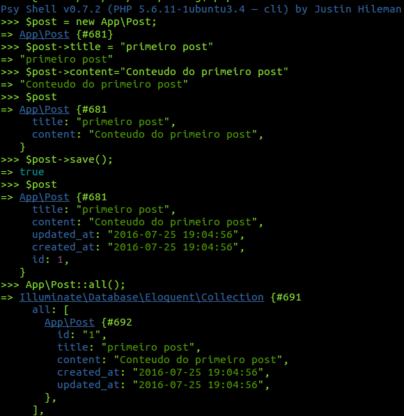

# Laravel PHP Framework - Blog (referência de estudos)


## O que é este projeto?
O projeto tem como objetivo disponibilizar os códigos para o curso laravel-express e ser um guia de referência/testes sobre Laravel para o autor.


## Para rodar este projeto
```bash
$ git clone https://github.com/fabiosperotto/laravel-blog
$ cd laravel-blog
$ composer install
$ cp .env.example .env
$ php artisan key:generate
$ php artisan migrate #antes de rodar este comando verifique sua configuracao com banco em .env
$ php artisan serve
$ php artisan db:seed #para gerar os seeders, dados de teste
```
Acesssar pela url: http://localhost:8000/blog


## Pré-requisitos
- PHP >= 5.5.9
- OpenSSL PHP Extension
- PDO PHP Extension
- Mbstring PHP Extension
- Tokenizer PHP Extension


## Anotações/Extras
As seções a seguir são anotações sobre o framework e podem não refletir a aplicação (blog) em desenvolvimento.


Composer:
```bash
$ curl -sS https://getcomposer.org/installer | php
$ sudo mv composer.phar /usr/local/bin/composer
$ sudo chmod +x /usr/local/bin/composer
$ sudo chmod -R 777 ~/.composer/cache/
$ sudo composer self-update
```

### Instalação Framework
```bash
$ composer global require "laravel/installer"
```

Exportar o path do laravel para Linux reconhecer os comandos (bash):

1. Incluir no final do arquivo ~/.bashrc: export PATH="~/.composer/vendor/bin:$PATH"

2. Depois executar: 
```bash
$ source ~/.bashrc 
```


### Criação de um projeto clean
```bash
$ laravel new nome_projeto
$ cd nome_projeto
$ php artisan serve
```

O último comando serve para testar a instalação, se em localhost:8000 aparecer LARAVEL escrito na página, tudo está ok. Ao utilizar o comando laravel new automaticamente a última versão do Laravel será baixada. Até a escrita deste documento o comando configura o Laravel 5.2. Caso deseja instalar laravel 5.1 LTS, substitua aquele primeiro comando por:
```bash
$ composer create-project --prefer-dist laravel/laravel nome-do-projeto 5.1.*
```

### Artisan
- Sistema de comandos do Laravel. Help em:
```bash
$ php artisan
```
- Remover arquivos de cache criado pelo Laravel:
```bash
$ php artisan clear-compiled 
```
- Colocar sistema em modo manutenção:
```bash
$ php artisan down 
```


### Tinker
- Ferramenta de interação com o projeto, objetos podem ser criados e salvos em banco de dados, ótimo para testes sem ter que criar telas:
```bash
$ php artisan tinker
```

- A ilustração a seguir demonstra o uso do tinker com objetos do tipo Post salvando no banco de dados:



### Estruturas importantes
- app/Http/routes.php: arquivo que define as rotas da aplicação.
- app/Http/Controllers: ficam os controllers da aplicação, o comando para gerar uma estrutura de um controlador é:
```bash
$ php artisan make:controller TestController
```
- resources: ficam as views da aplicação. Deixe imagens, CSS, JS e fontes na /public.
- As Models serão criadas na raiz de /app, para gerar uma model:
```bash
$ php artisan make:model Post
```
 

### Banco de dados
- Em config/database.php existem as configurações de conexão com variados tipos de banco de dados. Na linha 29, 'default' => env('DB_CONNECTION', 'mysql'), a instrução define que irá procurar por DB_CONNECTION e caso não encontrar, seleciona a conexão mysql. É possível trocar aqui o driver, mas as configurações ficam no .env na raíz do projeto.
- O Laravel se baseia em migrations, ou seja, é possível criar arquivos com toda a infraestrutura das tabelas para que, futuramente, o framework gere o banco de dados. Isto faz com que não seja necessário criar o banco de dados manualmente, facilita o controle das modificações de banco e registros padrão de testes podem ser utilizados/gerados.
- Para gerar uma tabela com migrations, segue o comando (o flag --create define o nome real da tabela no banco):
```bash
$ php artisan make:migration create_table_post --create=posts
```
- Após criar as migrações necessárias, podemos requisitar a criação das mesmas para o banco de dados executando:
```bash
$ php artisan migrate
```

- MassAssigment: é comum que para criar um registro no banco de dados, setamos todas as informações em um objeto e depois realizamos o insert do mesmo. Por exemplo, para um post de blog, podemos fazer $post->title = "Titulo"; $post->content = "conteúdo do post aqui". O Laravel por padrão de segurança, evita que isso seja possível, deixando habilitado somente a função save(). Assim uma requisição direta de criação de registro não poderá ser feita. Para habilitar o uso do create() entre outras esquemas de inserção, precisamos codificar no Model quais campos da tabela serão permitidos para MassAssigment. Para isso basta criar um array protegido chamado $fillable e especificar os nomes dos campos (ver model Post.php para exemplo).


### Gerador de dados fake
- Podemos usar a classe [Faker](https://github.com/fzaninotto/Faker#formatters) que vem no Laravel a partir da versão 5.1 para gerar dados para o banco de forma automatica e aleatória (poupa trabalho para testar aplicação). Em /database/factories/ModelFactory.php podemos descrever qual Model terá esse gerador e como os dados serão gerados para cada atributo do objeto. Detalhes da função feita para os posts podem ser visualizadas neste projeto. 
- Com o Tinker podemos gerar um objeto com os dados fake e salvá-lo na base de dados:
```bash
>>> factory('App\Post')->make();
>>> factory('App\Post')->create();
```
- Ou podemos gerar 5 objetos com dados fake e já submetê-los para a base:
```bash
>>> factory('App\Post', 5)->create();
```
- Uma forma, automatizada, de gerar dados fake para o banco de dados é a utilização de Seeds (/database/seeds/DatabaseSeeder.php), que que podem limpar a base de dados e injetar os dados especificados pela factory anteriormente. Com o artisan podemos criar um table seeder como:
```bash
$ php artisan make:seeder PostsTableSeeder
```
- Um arquivo com o nome especificado (PostsTableSeeder), será criado no diretório de seeds. Neste projeto perceberá que o seeder pode realizar o truncate na tabela e insere 12 registros geradros pela Faker que configuramos na Factory anteriormente. Não se esqueça de editar o arquivo DatabaseSeeder.php e adicionar a função que realiza o call() do seeder (desta forma também podemos criar seeders mas chamá-los somente de acordo com a necessidade). Para executar todos os seeders:
```bash
$ php artisan db:seed
```


